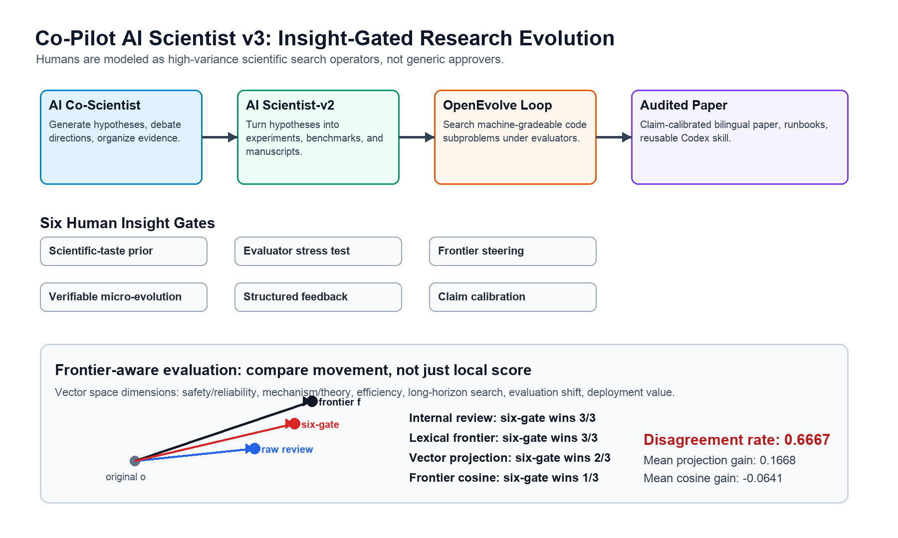

# Co-Pilot AI Scientist v3：面向协作式自动科研的洞察门控科研演化

## 摘要

自动科研智能体已经可以提出假设、运行实验、撰写论文并优化代码，但它们仍缺少一种原则化方式来利用人类科研品味：也就是人类判断哪些问题、失败、机制或主张边界更值得追求的非指标化能力。普通 co-pilot 工作流往往把人类当作审批者或编辑者；完全自动化系统则可能移除科学研究中最关键的判断。本论文提出洞察门控科研演化（Insight-Gated Research Evolution, IGRE），把人类科研品味与专家评审洞察转化为 AI Scientist-v2 式科研循环中的显式控制信号。IGRE 包含六类门控：科研品味先验、评估器压力测试、前沿方向调度、可验证微演化、结构化反馈、主张校准。本文进一步提出时间前沿回放（Temporal Frontier Replay, TFR），用离线回放协议检验历史同行评审是否本可以把自动科研引向后来的学科轨迹。IGRE 与 TFR 共同使人类参与不再被默认视为正向影响，而是可以被测量和审计：门控记录证据、注意力成本和主张边界，历史评审信号则根据未来前沿证据接受回放检验。我们基于 FML-bench 式运行、SSH Ubuntu 上的 prospective matched-budget Max-Cut 微型实验、OpenEvolve 式微演化实验、OpenReview 专家评审信号、成对论文生成探针、TFR 审计和 clean-clone 可复现性检查构建证据包。当前证据支持一个保守结论：专家评审文本可以映射为可行动的工作流门控；评审引导的再生成在跨模型复审下能改善部分科研产物；三条真实四条件 TFR 回放在严格预注册规则下仍是混合结果；SSH Max-Cut 微型实验显示机器可评分的 frontier-steering gate 可以被前瞻性审计；短预算人类门控 FML 运行则是混合或负向结果，而不是自动优于全自动基线。因此本文不是“人类总能提升自动科研”的证明，而是一种用于设计、比较和审计人类洞察如何改变科研搜索过程的可复现方法。

## 1. 引言

近期 AI 科研智能体已经展现出很强的自动化能力。AI Scientist-v2 可以生成想法、运行实验并产出论文。AI Co-Scientist 式系统通过生成、讨论和演化组织假设前沿。AlphaEvolve 则表明，当候选程序可以被自动评估时，语言模型能够驱动演化式代码搜索。这些系统容易导向一个诱人的结论：只要 benchmark 和 evaluator 足够清楚，人类就可以从科研循环中移除。

但科学研究并不只是优化一个可见指标。科学家还要判断哪些问题深刻，哪些失败有信息量，哪些机制值得拆解，哪些结果不足以支撑强主张。这些判断常被称为科研品味或洞察。它们无法完全被 benchmark 分数捕捉，但也不是不可观察的玄学：它们具体出现在论文评审、rebuttal、组会讨论、主张审计以及放弃或重构研究方向的决策中。

因此本文不问“人类参与是否总是优于全自动科研”这个过于粗糙的问题。本文的问题是：哪些人类参与形式可以转化为工作流控制信号，从而改善自动科研的搜索过程或责任边界？这个问题更重要，因为人类参与本身具有高方差。一个人类门控可能把系统引向罕见的高价值方向，也可能拖慢运行、引入偏见、过拟合个人品味，或者选择比全自动策略更差的分支。可信的 co-pilot 方法必须同时测量正面和负面影响。

我们提出 IGRE，这是 Co-Pilot AI Scientist v3 的核心算法模式。IGRE 受已有自动科研系统启发，但不是把几篇论文的方法拼接在一起。它围绕一个不同对象重新组织这些思想：不是单纯追求全自动发现，而是在自动科研循环中识别人类科研品味适合介入的位置，并把这种介入变成可记录、可比较、可审计的搜索算子。IGRE 可以改变研究方向先验，压力测试评估器，调度假设前沿，触发小规模可验证程序搜索，结构化稿件反馈，或校准最终论文主张。

因此本文的主张被有意收窄：专家评审与人类科研判断可以被操作化为可审计的工作流控制信号，而这些信号的有效性可以通过实验比较。我们不声称当前 co-pilot 系统已经优于全自动 AI Scientist-v2。本文贡献包括四点。第一，定义 IGRE 作为人类引导自动科研的六门控架构。第二，发布包含英文论文、脚本、日志、门控 schema、审计文件和可复用 Codex skill 的可复现证据包。第三，提出时间前沿回放（Temporal Frontier Replay, TFR），用历史同行评审检验人类洞察是否本可以把自动科研引向后来的学科轨迹。第四，在报告正向工作流探针的同时，也报告混合和负向短预算结果，明确主张边界：当前 IGRE 支持的是工作流设计和测量就绪性，而不是顶会级别的 co-pilot 优越性证明。

## 2. 相关工作

AI Scientist-v2 代表全自动科研智能体路线：生成想法、执行实验、撰写论文并评估输出。它的优势是端到端自动化，但人类科研品味并不是其算法中的一等对象。AI Co-Scientist 式工作强调假设生成、批判、排序和演化，与 IGRE 同样把科研看成前沿搜索；但 IGRE 增加了显式人类门控、注意力成本日志和主张校准。

另一条实践路线是把学术劳动封装成可复用的 research skill 或 manuscript-copilot workflow。PaperOrchestra 提出多智能体论文写作框架，并在人工评估中报告相对全自动写作基线的优势；`academic-research-skills` 与 `Claude-Code-Skills-for-Academics` 等公开 skill bundle 则把文献综述、论文写作、论文评审、引用检查、数据 profiling、代码审计、修订流程和会话管理拆成可复用模块。在这条线上，PaperOrchestra 不只是并列的论文写作系统，也是 `academic-research-skills` 这类学术 skill bundle 的理论来源之一：后者把多智能体论文写作、验证与修订思想工程化为持久工作流模块。这条线很重要，因为它说明科研辅助可以成为稳定工作流资产，而不只是一次性 prompt。IGRE 参考这类系统的工程组织方式，但算法对象不同：它不把“写作技能”或“pipeline stage”作为核心单位，而是把 human-insight gate 作为核心单位，判断科研先验、evaluator、前沿分支、微演化任务、反馈结构或主张边界是否应该被改变。换言之，manuscript-copilot skills 帮助生产和审计科研产物；IGRE 研究的是哪些人类科研品味应该控制产生这些产物的科学搜索。

AlphaEvolve 和 OpenEvolve 启发了 IGRE 的可验证微演化门控。它们表明，语言模型生成的代码修改可以通过自动评估进行演化。IGRE 对此采取选择性使用：只有当目标可机器评分且额外搜索成本合理时，才触发微演化，而不是把程序搜索当作所有问题的通用替代。

Schmidhuber 的自指学习和代码自我改进路线提供了另一条重要背景。1987 年的 self-referential learning 工作已经提出让学习过程检查和修改自身机制；OOPS 把程序和搜索过程纳入增量式通用搜索；Gödel Machine 要求系统在证明自我改写有收益后才改写自身；POWERPLAY 则同时搜索新任务和 solver modification，并保持已经解决的任务能力。近年的 Darwin Gödel Machine 与 Huxley-Gödel Machine 把这条路线推进到 coding agent 自我改造。IGRE 与这条线的区别在于，它不直接演化 autonomous agent 的完整源码，而是在人类 insight gate 下演化科研轨迹、evaluator、可验证子程序和主张边界。

人机 co-pilot 系统通常提供辅助、编辑或审批。IGRE 的区别在于把人类角色算法化：一次人类介入必须被分类、记录、连接到证据，并根据下游结果接受审计。重点不是假设每条人类意见都有用，而是识别哪些意见能作为科研搜索控制信号。

OpenReview 等同行评审数据集为这个问题提供了重要代理。真实评审包含人类对新颖性、评估、正确性、清晰度、影响力和主张边界的判断。它们不完美、有噪声、且是回顾性的，但它们是少数大规模公开的人类专家科研品味痕迹。IGRE 不把它们当成实时 co-pilot 数据的替代品，而是把它们作为参与模式设计的离线测试床。

## 3. 方法：洞察门控科研演化

IGRE 把一次科研运行建模为一连串机器动作与显式门控的交替过程。每个门控都可以改变下一步动作，但必须记录理由、证据、成本和主张边界。这样，人类参与就能被审计，并能与全自动基线比较。

第一类门控是科研品味先验。它在昂贵实验之前选择或重加权研究方向。有效的品味先验不能只是模糊偏好，而要说明一个方向为什么有问题深度、新颖潜力、机制价值、失败信息量、benchmark 适配性或非对称上行收益。当前证据包用 OpenReview 的 novelty 和 impact 类评论作为离线代理。

第二类门控是评估器压力测试。它检查指标是否过于容易、狭窄或可被投机取巧。自动科研尤其需要这一门控，因为智能体可能优化 evaluator 却偏离科学目标。关于缺少 baseline、指标薄弱、数据泄漏、消融不足或比较无效的评审意见会被路由到这里。

第三类门控是前沿方向调度。它作用于假设或实现分支组合。人类或评审派生信号不是在最后审批单个输出，而是在搜索过程中决定哪部分前沿应该获得更多预算。当前期分数不等于长期价值时，这一门控尤其重要。

第四类门控是可验证微演化。它把 OpenEvolve 式程序搜索用于狭窄、可机器评分的子问题，例如启发式设计、向量化、表格建模或小型组合优化目标。IGRE 把它视作升级算子：当任务简单、评估昂贵或搜索相对强 baseline 没有明显边际价值时，直接编辑仍然更合适。

第五类门控是结构化反馈。它把关于清晰度、可复现性、定义缺失、组织结构和读者理解成本的评审意见转化为明确修订计划。这个门控重要，是因为许多有价值的评审并不直接改变算法或 benchmark，却会决定科研产物是否能被理解、复现和比较。

第六类门控是主张校准。它编辑的是论文层面的证据解释，而不只是语言润色。它决定一个结果究竟支持优越性、可行性、测量就绪性、负结果，还是只能作为未来工作。许多专家评审真正有用之处，正是迫使作者收缩主张边界。

这些门控形成如下算法循环：系统提出研究前沿，评估早期产物，把人类或评审派生信号映射为门控动作，更新前沿或 evaluator，必要时执行微演化，最后生成经过主张审计的论文。每个门控记录门控类型、被审查产物、候选选项、决策、理由、预期收益、潜在伤害、注意力成本和下游证据。这一结构使 IGRE 区别于非正式 co-pilot 互动。

一个具体运行例子如下。假设 AI Scientist-v2 式循环提出一个面向小型表格模型的 robustness benchmark。AI Co-Scientist 式前端先生成若干假设：分布偏移检测、metric-gaming avoidance、低成本 evaluator repair。科研品味先验门控保留 evaluator-repair 方向，因为它的失败信息量更清楚，也能暴露自动科研中常见的评估器投机问题。随后 evaluator-stress gate 拒绝一个会奖励 all-negative classifier 的 primary metric，并加入 balanced-utility guardrail。在下一次预算节点，frontier steering 保留一个早期分数不是最高、但更能测试诊断性失败模式的分支。如果该分支包含小型可机器评分启发式，verifiable micro-evolution 就在 guardrailed evaluator 下运行 OpenEvolve 式搜索。论文草稿生成后，structured feedback 把评审意见转为具体消融和表达修订；claim calibration 则阻止论文把“发现 metric gaming”夸大成“co-pilot 整体优越性”。关键不在于每次运行都触发全部门控，而在于每次人类或评审派生介入都有明确类型、明确影响对象和独立证据记录。

IGRE 还定义一个跨门控元策略：长期科研品味门控（Long-Horizon Taste
Gate, LHTG）。LHTG 用来操作化本文最核心的直觉：一条人类评议可能让下一版产物在短期质量评分上更差，却把科研轨迹推向后来主流或 SOTA 方向。LHTG 寻找 delayed-value review signals（DVRS），也就是同时包含短期摩擦和长期方向性的评审或人类门控信号。DVRS 不会被默认视为正确；系统会把其可行动部分路由到合适的 IGRE gate，放入 TFR replay queue，并同时审计即时产物质量与未来前沿对齐。这让本文方法区别于普通 co-pilot 辅助：科研品味不是审批、偏好标注或额外上下文，而是一种选择性、带风险、可检验的搜索覆盖信号。

IGRE 还包含一个离线学习与评估模式：时间前沿回放（Temporal Frontier Replay, TFR）。TFR 的作用，是把回顾性的同行评审数据转化为科研品味测试，而不只是又一个论文质量 rubric。给定时间 `t` 的历史论文、它收到的评审意见，以及时间 `t + delta` 的后续学科证据，TFR 构造三个回放条件：paper-only、review-guided 和 shuffled-review-control。然后它检验 review-guided 回放究竟只是改善了局部产物质量，还是也把生成的研究计划推向了后来的主流或 SOTA 方向。delayed-value signal 指的是时间不对称情形：评审引导可能让短期产物在即时评分上更差，但却更接近后来的学科演化方向。这正是 IGRE 试图保留的人类科研品味。

TFR 不是额外搬来的 benchmark，而是 co-pilot 问题本身要求的方法调整。普通 benchmark 比较的是一个分支现在是否获胜；TFR 比较的是一条人类评论是否改变了 agent 未来应该搜索什么。当前证据包通过确定性 smoke、引用驱动前沿 probe、评审-前沿信号挖掘、语义前沿 judge 和三条真实四条件回放实现 TFR。这些 probe 规模仍小，而且尚未建立正向 delayed-value 证据；但它们使高尾部假设变得可证伪：有用的人类洞察必须被路由、回放，并根据未来前沿接受检验，而不能因为它来自人类评审就被默认视为有价值。

## 4. 实验

实验目标是比较人类参与模式，而不是证明人类总是胜过自动化。证据包围绕四个问题展开。

主要量化证据如下表所示。表中有正向、混合和负向结果，因为 IGRE 被评估为一种门控选择框架，而不是保证提升性能的技巧。

| 探针 | Co-pilot 或 review-guided 结果 | Baseline 或 autonomous 结果 | 增量或胜负 | 解释 |
| --- | ---: | ---: | ---: | --- |
| Review utility map | 398 条可行动片段 | 64 条噪声片段 | 共 473 条片段 | 专家评审包含可路由的 taste/insight 信号。 |
| 门控结构消融 | full IGRE utility capture 1.000 | 最佳单门控 0.369；随机门控均值 0.199；no-gate 0.000 | full 相对最佳单门控 +2359 utility units | 多门控是必要结构，因为评审洞察是异质信号；这是路由证据，不是下游质量证明。 |
| Held-out review-gate validation | full selected policy utility capture 1.000 | 最佳单门控 0.374；随机类别均值 0.706；no-gate 0.000 | 来自 32 篇论文的 94 条 held-out reviews | 论文级 train/held-out split 降低 review-to-gate 路由的样本复用偏差；不是独立人类标签。 |
| 门控-结果归因 | full IGRE aligned score 75.17 | 最佳单门控 37.25；随机门控均值 15.26 | full 相对最佳单门控 +37.92 | 基于 6 个 OpenReview pair 的事后下游归因；不是因果证明。 |
| 单门控产物消融 | 最佳单门控均值 3.6667 | full review-guided 3.5；baseline 2.9166 | 最佳单门控相对 baseline +0.7501 | 因果风格 mini-artifact 消融；小规模 proxy 中 targeted evaluator-stress 可超过 full review guidance。 |
| OpenReview 再生成，同模型评分 | review-guided 胜 5 次 | baseline 胜 1 次 | mean overall +0.8333 | 正向，但可能受同模型评分和额外上下文影响。 |
| OpenReview 再生成，Claude 复审 | review-guided 胜 3 次 | baseline 胜 1 次，平 2 次 | mean overall +0.1667 | 有温和正向信号，但不是自动提升。 |
| OpenReview 等上下文消融 | review-guided 票数 8 | context-control 票数 1，平 3 | 跨模型 mean delta +0.5 | 真实相关评审优于等量无关评审上下文，但 Claude 显示效果较温和。 |
| 深度案例内部六门控评议 | six-gate hybrid 胜 3/3 | raw review-guided 胜 0/3 | 内部平均增量 +1.133 | 闭合当前 3 个具体案例的可复现内部评议流程；这是确定性 rubric proxy，不是人类专家证据。 |
| 前沿对齐 taxonomy | six-gate hybrid 胜 3/3 | raw review-guided 胜 0/3 | 词汇式前沿对齐平均增量 +3.467 | 使用 ICLR/ICML/ACL 2025 官方获奖论文作为 seed，比较再生成产物与当前前沿主题的对齐，而不只用局部实验分数判断好坏。 |
| 前沿向量图 | six-gate 平均投影增益 +0.1668 | six-gate 平均 cosine 增益 -0.0641 | 2 个投影正向案例，1 个负向案例 | 将原论文、再生成产物和当前前沿中心表示为 6 维向量；显示词汇前沿增益仍可能包含方向漂移。 |
| 前沿指标分歧矩阵 | 内部评议和词汇指标均 six-gate 胜 3/3 | 向量投影 six-gate 胜 2/3；cosine six-gate 胜 1/3 | 分歧率 0.6667 | 说明短期评议胜利、词汇前沿覆盖和向量移动衡量的是不同对象。 |
| 预注册盲评专家评审包 | 已准备 6 对匿名 A/B 产物 | 已完成人类评分 0 行 | 计划 3-5 名评审者 | 仅表示评估就绪，不声称已有人工证据。 |
| 模型-only 盲评包 dry run | review-guided 胜 0 次 | context-control 胜 7 次，平 1 次 | review-guided 减 control 均值 -1.1458 | 验证盲评包和统计流程，同时暴露负结果：未经过合适门控路由的评审文本可能在盲评中明显变差；这不是人类证据。 |
| Live skill invocation smoke | 生成 3 个候选方向和一个归档的一版 IGRE gate plan | template-only skill smoke | 2 次真实模型调用，audit recommendation pass | 说明 Codex skill 可在新任务上复用；不是 benchmark 证据。 |
| Standalone skill install smoke | public release scaffold 安装到隔离 `CODEX_SKILLS_DIR` 并通过 installed validator | release files without install execution | 检查 14 个 required files；install smoke pass | 工程迁移性证据，说明 IGRE skill 包可安装和自验证；不是科学优越性证据。 |
| External clean skill reuse smoke | release skill 被复制到 `/tmp` 外部 skills 目录，并用于新的 scientific-visualization 主题 | 无外部研究者、无 benchmark、无人类评分 | 实例化 6/6 个 IGRE gates；engineering-chain audit 6/6 | 证明 public skill package 的 clean-environment transfer；不是社区采用或科学优越性证据。 |
| Metric-gaming evaluator-stress smoke | evaluator-stress gate 选择 `guardrailed_utility_model` | primary-only 公平性指标选择 `metric_gaming_all_negative` | 减少 1 个合成 metric-gaming 事件 | 将 live skill 任务连接到真实 evaluator；这是受控 toy 证据，不是 FML-bench 结果。 |
| FML Fairness evaluator-stress replay | gate 拒绝 metric-gaming 并中止无有效 continuation | primary-only FML 指标选择 `metric_gaming_all_negative` | 减少 1 个归档 FML metric-gaming 事件 | 真实 FML-Bench artifact replay；支持 gate 设计，不支持公平性提升。 |
| 回溯式前沿对齐 smoke | review-guided 胜 1 次 | shuffled-control 胜 5 次 | 相对 control 平均增量 -0.0855；delayed-value 0 例；短期正向/长期负向 3 例 | 未来前沿对齐比局部论文改进更难；当前仅为启发式 descriptor。 |
| 引用驱动前沿 pilot | review-guided 胜 1 次 | paper-only 胜 3 次；shuffled-control 胜 1 次；1 例不可评分 | 6 篇论文，80 条相关性过滤后的后续引用，相对 paper-only 均值 -0.02 | 已加入相关性过滤和标题重合度误配保护；未发现 delayed-value case，并出现 3 个短期正向/长期负向案例。 |
| 评审-前沿信号挖掘 | 最佳评审片段均值 0.1431 | paper context 0.2369；review-guided artifact 0.1906 | 0 个 review-beats-paper 案例；0 个 latent delayed-value candidate | 历史评审包含可路由 gate，但这个词汇式未来前沿测试显示，原论文上下文比评审片段携带更多 citation-frontier 术语。 |
| 语义前沿 judge | review-guided artifact 胜 1 次 | paper context 胜 4 次 | 5 个模型评判案例；0 个 delayed-value candidate | 使用引用元数据的模型 judge 仍偏好原论文上下文；唯一 review-guided 胜例是短期和语义都正向，不是 delayed-value。 |
| Delayed-value 候选挖掘 | 120 条 replay candidates | 90 条 short-term repair signals；176 条 generic/unrouted | 筛选 473 条 reviews；candidate rate 0.2537 | 先筛出值得昂贵 TFR 验证的评论；这些是候选，不是 positive delayed-value 证据。 |
| 候选-前沿验证 | delayed candidates 均值 0.24 | controls 均值 0.176 | 16 条尝试中 13 条可评分；delayed-control +0.064 | 弱 OpenAlex 词汇证据显示 replay queue 优于任意控制评论；不是 delayed-value 证明。 |
| 真实四条件 TFR 回放 | 原始模型 judge 将 3/3 case 标为 positive | 严格预注册规则将 3/3 修正为 mixed | 3 个 case；6 次 same-model 真实调用；strict positives 0 | 说明 TFR 需要确定性规则校验：当短期惩罚条件不成立时，模型乐观判断会被纠正。 |
| 跨模型 TFR 复评 | Claude 在 3/3 case 中选择 six-gate hybrid 为 frontier winner | 3/3 strict label 仍是 mixed；其中一个 Claude model label 为 negative；一次 Gemini 返回 malformed JSON | 3 个成功 Claude judge | 降低同模型偏差，并指出 gate actions 经常改善前沿 framing，但没有充分传导到数据集、指标、机制或形式化识别条件。 |
| Prospective matched packages | co-pilot 或人类选分支胜 2 次，其中 SSH Max-Cut mean normalized score 为 0.984419 | autonomous / tie / invalid 3 次；SSH Max-Cut autonomous mean 为 0.596214 | 5 个 package；SSH Max-Cut delta +0.388205 | prospective package 形状和机器可评分 frontier steering 已能在远程机器上审计，但仍不支持短预算平均 benchmark 优越性。 |
| Same-run online FML smokes | co-pilot benchmark 胜 0 次 | autonomous 胜 1 次，平 1 次，未知 1 次 | 3 个 paired smoke | 当前有效 benchmark 证据偏向 autonomous 或平局。 |
| 端到端配对轨迹稿件 | co-pilot 稿件内部得分 4.64；模型复审 2/2 偏好 co-pilot | autonomous 稿件内部得分 3.48；autonomous benchmark 指标 0.640451 优于 0.862015 | 一个 same-run smoke pair | 证明连续轨迹到稿件的可比较性和指标/质量分歧，不证明 co-pilot 优越性。 |
| MLAgentBench vectorization | 8/8 seeds 保持正确，median 0.024581 s | starter 3.261186 s；direct rewrite 未通过正确性 | 显著运行时间收益 | 可验证微演化适合 correctness-gated 代码子问题。 |
| Sklearn diabetes tabular probe | OpenEvolve median RMSE 55.895460 | direct rewrite RMSE 55.895460 | 无搜索优势 | 简单建模任务中直接编辑可能足够。 |

非 FML benchmark 扩展部分被有意以“阻塞 setup 尝试”的形式报告，而不是隐藏。除了已经可评分的 MLAgentBench vectorization 任务，我们还尝试了官方 MLAgentBench CIFAR10/debug、IMDB、CLRS 和 house-price setup。CIFAR10 已到达官方数据源，但在当前交互预算内下载过慢；IMDB 被 Hugging Face 网络访问阻塞；CLRS 已到达 `train.py`，但 CPU 运行超时且没有生成 checkpoint；house-price 到达官方 prepare script，但需要 Kaggle tooling，并且很可能需要竞赛规则同意。这些都不是分数，但它们是有用的 benchmark selection 证据：IGRE 当前的正向非 FML 结果仍然很窄，在完成第二个官方可评分任务前，论文不应暗示已经具备广泛官方 benchmark 覆盖。

由此得到的主张-证据映射被有意保持保守。

| 论文主张 | 证据状态 | 主张边界 |
| --- | --- | --- |
| IGRE 是本文提出的六门控方法，把人类科研品味视为可记录的科研控制信号。 | 作为方法和 artifact 贡献已支持。 | 不等于每一次人类介入都会改善结果。 |
| OpenReview 式专家评审可作为离线工作流设计中的人类 taste/insight 代理。 | routeability 已支持：398 条可行动片段，多门控 utility capture 明显优于单门控。 | 离线同行评审不等于实时 co-pilot 数据。 |
| 有针对性的门控路由可能比把全部人类上下文都喂给 agent 更有用。 | 单门控产物消融给出窄范围支持。 | 目前只是模型评审 mini-artifact，需要人类专家验证。 |
| TFR 可以检验历史评审是否本可以把自动科研推向后来的学科前沿。 | 作为可运行回放协议已操作化；候选挖掘筛出 120 条评论，小型 OpenAlex 验证显示 delayed candidates 相对 controls 有 +0.064 词汇前沿优势，并已执行三条真实四条件 replay。 | 当前已验证 probe 发现 0 个严格 delayed-value case；三条真实 replay 经预注册规则修正后均为 mixed，因此长期高尾假设尚未被证明。 |
| 短预算人类门控 FML 运行优于全自动运行。 | 不支持。 | 当前证据混合或负向，应作为失败模式经验而非优越性证据。 |
| OpenEvolve 式微演化能改善部分可机器评分子问题。 | 窄范围支持。 | 应选择性触发；简单任务中直接编辑仍有竞争力。 |

### 4.1 专家评审文本能否映射为有用的工作流门控？

我们通过流式访问 Hugging Face 上的 `nhop/OpenReview` 数据集，避免完整下载。探针确认数据集包含 34,638 行，并抽样 160 行。从这些样本中，确定性 review-utility map 提取 473 条评审片段，其中 398 条被标记为可行动信号，64 条被标记为噪声或低行动性信号。

最常见的可行动路由是评估器压力测试，共 245 次触发。结构化反馈有 210 次触发，主张校准 140 次，科研品味先验 111 次。从类别看，评价和指标问题出现 205 次，局限性和主张边界问题 140 次，新颖性和定位问题 111 次，可复现性问题 79 次，方法正确性问题 71 次。

随后我们在同一 review-utility map 上运行门控结构消融。no-gate 策略捕获不到可行动路由 utility。最佳单门控是 evaluator stress testing，只能捕获 0.369 的可用 utility；structured feedback 捕获 0.295；claim calibration 捕获 0.187；scientific-taste prior 捕获 0.148。128 个 seed 的随机门控基线平均捕获 0.199。完整 IGRE 保留六类显式门控，因此捕获 1.000。这个消融不证明最终论文一定更好，但它说明 IGRE 的结构动机：人类评审洞察不是一个泛泛审批信号，如果压缩为单一 gate，就会系统性丢失科研品味、评估设计和主张边界信息。

为了降低样本复用偏差，我们进一步运行论文级 held-out validation。系统只在 379 条 train reviews 上选择可行动类别，然后在来自 32 篇论文的 94 条 held-out reviews 上评估所得 gate policy。full selected policy 在 held-out 上捕获 1.000 的确定性 utility，并路由 0.798 的评审，noisy-only routes 为 0。最佳单门控 evaluator stress testing 捕获 0.374 utility；512 个 seed 的随机类别 baseline 平均捕获 0.706。这个实验仍是离线规则式 proxy，不是独立人类标签；但它说明 review-to-gate 映射并不只是同一样本上的拟合产物。

最后，我们使用 6 个等上下文 OpenReview 再生成 pair 运行下游门控-结果归因探针。该探针把每篇论文的 review-derived gate utility 与 GPT 和 Claude 评分器观察到的 review-guided 减 context-control 分数增量相连。完整 IGRE 的 aligned-outcome score 为 75.17；最佳单门控 evaluator stress testing 为 37.25；512 个 seed 的随机单门控基线均值为 15.26。观察到的最强下游对齐来自 evaluator stress testing、structured feedback 和 scientific-taste prior。frontier steering 与 claim calibration 在这个 6 篇子集中没有非零信号，因此这只是事后归因信号，不是六类门控的因果下游证明。

随后我们运行因果风格的单门控产物消融。对于每篇选中论文，我们分别只给 title/abstract 加上一类 gate-specific 评审片段，生成新的 mini-paper artifact，并与 title/abstract baseline 和 full review-guided artifact 在 GPT 与 Claude 评分器下比较。最佳单门控条件是 evaluator stress testing，mean overall 为 3.6667；full review-guided 为 3.5；baseline 为 2.9166。winner votes 分别为 baseline 3、full review-guided 2、evaluator stress testing 6、structured feedback 1。这个结果重要之处在于它并不是简单支持“人类越多越好”。它说明 targeted evaluator-stress review 在小规模 proxy 中可能比输入全部评审更有用，而对信息充分的摘要，baseline 仍可能有竞争力。因此 IGRE 需要的是门控选择，而不是最大化人类上下文。

这支持本文的核心前提：人类真实论文评审意见就是科研品味和科研洞察的具体痕迹。但有用的并不是所有评审文本，而是其中能够改变 evaluator 设计、搜索方向、论文结构或主张边界的部分。

### 4.2 评审引导的再生成是否改善科研产物？

我们选择 6 篇 ML/AI OpenReview 论文并生成成对 mini-paper 产物。baseline 条件只使用标题和摘要；review-guided 条件额外使用真实评审片段和 decision 文本。初始评分器偏好 review-guided 产物 5/6 次，平均 overall score 从 3.0 提升到 3.8333。

为降低同模型评分偏差，我们用更严格的跨模型复审重新评分同一批 6 对产物。在该复审中，review-guided 胜出 3/6 次，baseline 胜出 1 次，2 次平局，平均增量缩小为 +0.1667。保守结论是：当评审文本带来具体方法细节、实验特异性、局限意识或主张校准时，它是有用的；当反馈过于泛化，或使再生成产物丢失原始技术框架时，它并不自动有益。

这个探针还有一个重要混淆：review-guided 条件比 title/abstract baseline 获得了更多信息。因此我们进一步运行等上下文消融，用等长无关 OpenReview 片段生成 context-control 条件。跨两个 reviewer 模型和 6 篇论文，review-guided 获得 8 个胜出票，context-control 获得 1 个胜出票，3 次平局，跨模型平均增量为 +0.5。更严格的 Claude 复审给出 review-guided 胜 3 次、context-control 胜 0 次、平 3 次，平均增量 +0.1667。这支持更精确的结论：真实相关评审确实可能提供超过通用 reviewer pressure 的价值，但主要发生在评审包含具体方法细节或明确主张校准警告时。

### 4.3 再生成产物是否向当前科研前沿移动？

局部论文质量分数不足以支撑本文最核心的判断。某条人类评审意见可能降低短期 benchmark 或写作分数，却把科研轨迹推向后来真正重要的方向；反过来，它也可能提高 reviewer 满意度，却让产物偏离当前前沿。因此我们加入前沿对齐向量图（Frontier Alignment Vector Graph, FAVG），用来量化原论文、评审引导产物和当前前沿之间的方向关系。FAVG 评估的是科研轨迹移动，而不只是下一篇产物的局部分数。

我们从 ICLR、ICML 和 ACL 2025 官方获奖论文页面构造一个小型当前前沿 taxonomy，并定义 6 维前沿空间：安全/可靠/对齐，机制/理论洞察，效率系统/推理，长程自适应搜索，评估/benchmark 转移，以及部署/社会价值。每篇原论文、raw review-guided 产物、six-gate hybrid 产物和前沿 seed 都被映射为该空间中的非负向量。设 `o` 为原论文向量，`a` 为再生成产物向量，`f` 为当前前沿 seed 的中心向量。我们报告三个互补量：

1. `cos(a, f) - cos(o, f)`，表示产物相对原论文与当前前沿中心的直接相似度变化。
2. `dot(a - o, f - o) / ||f - o||`，表示从原论文到产物的移动，在原论文到当前前沿方向上的投影。
3. `a - o` 在 `f - o` 正交方向上的范数，表示不是直接靠近当前前沿、而是横向探索出的新颖性。

FAVG 这个向量视角比单一标量更稳健。在 3 个深度案例中，词汇式前沿对齐分数显示 six-gate hybrid 全部胜出，平均增量为 +3.467。但前沿向量图给出更细的诊断：six-gate 平均投影增益为 +0.1668，平均 cosine 增益为 -0.0641；其中 2 个案例更沿着原论文到当前前沿的方向移动，1 个案例则偏离该方向。这个混合信号正说明 IGRE 需要前沿感知门控。有用的人类洞察并不只是让下一篇产物得分更高的评论，而是能改变搜索向量、把科研轨迹推向值得追踪的方向，或有意产生正交新颖性并交给后续证据检验的评论。FAVG 因此不是奖励模型，而是用于决定哪些人类引导方向值得进一步回放、专家盲评或 prospective matched-budget 实验的诊断层。

因此我们进一步加入三例深度案例的指标分歧矩阵。内部评议和词汇式前沿指标都显示 six-gate hybrid 胜出 3/3；但向量投影只显示 six-gate 胜出 2/3，前沿 cosine 只显示 six-gate 胜出 1/3，分歧率为 0.6667。这不是向量图失败，而是本文需要的测量结果：它防止论文把科研品味压缩成单一分数，也让我们看见某些人类引导产物虽然提高了局部质量，却在科研方向移动上变得更复杂。

### 4.4 短预算人类门控是否优于全自动基线？

当前 prospective matched packages 被有意报告为混合结果，而不是包装成清晰的优越性证明。在已通过审计的包中，现在有两个受控案例显示 co-pilot 或人类选择分支有用；但 3 个 FML-bench 案例中，co-pilot 分支出现失败、平局、中止或无法产生有效 continuation。最新的 prospective package 是 SSH Ubuntu 上的 weighted Max-Cut 微型实验：它在同一组 12 个确定性的 8 节点 graph instances 上比较 autonomous alternating baseline 与 co-pilot 选择的 local-search branch，并用 brute-force optimum 计算 normalized score。autonomous baseline 的 mean normalized score 为 0.596214，minimum score 为 0.290323；co-pilot 选择分支的 mean normalized score 为 0.984419，minimum score 为 0.904762，mean delta 为 +0.388205。这是一个真实远程 matched-budget run，包含完整 gate logs 和 package audit，但它仍只是小型机器可评分子问题，不是 AI Scientist-v2 论文质量 benchmark。在重复在线 paired FML smoke 中，有效 Causality 运行仍然得到 0 次 co-pilot benchmark 胜出、1 次 autonomous 胜出、1 次平局；Fairness 运行是 no-valid-branch 失败案例。

这个结果很重要。它阻止论文声称人类参与在短预算平均 benchmark 表现上已经有优势。相反，它强化了本文真正的问题：人类门控必须具体、预算敏感，并且被路由到科研品味和洞察确实能改变轨迹的位置。

我们还从一条在线 full-gate trajectory 生成了 same-run 端到端稿件对。co-pilot 条件依次经过 idea selection、evaluator approval、branch selection、program-search escalation 和 claim audit，并生成绑定轨迹证据的稿件；autonomous 条件则使用同一次在线运行中的 autonomous baseline summary，并采用同一类 evidence-bound 稿件模板。这个配对结果刻意保持混合：co-pilot 稿件在内部结构与主张校准评分上更高（4.64 对 3.48），两个模型评审在匿名 A/B prompt 下也都偏好 co-pilot 稿件；但 autonomous baseline 赢得 benchmark 指标（0.640451 对 0.862015，越低越好）。这支持的是工作流完成度和可比较性，而不是 co-pilot 自动科研已经优于 autonomous baseline。它也说明 IGRE 为什么必须把 benchmark 分数、稿件质量、主张校准和人类注意力成本分开评估。

### 4.5 何时应该触发可验证微演化？

OpenEvolve 式搜索在某些可机器评分子问题上有效，但并非总是必要。在 vectorization 任务中，直接 rewrite 未通过 correctness gate，而短程 OpenEvolve 式搜索能保持正确性并找到显著运行时间改进。在 Max-Cut 中，直接编辑已经改善 starter，OpenEvolve 式搜索只带来小幅额外收益。在简单 sklearn diabetes 回归探针中，直接编辑达到与 OpenEvolve 中位数相当的 RMSE。这个边界条件是 IGRE 的核心：程序搜索应由 evaluator 就绪性和预期边际收益触发，而不是由方法潮流触发。

### 4.6 负结果如何反过来改变方法？

本文的负结果和混合结果不只是局限性，它们本身也是算法设计信号。因此我们新增一个 mixed-evidence audit，把每类失败映射到对应的 IGRE 设计规则。最强的警告来自模型-only 盲评包 dry run：review-guided artifact 获得 0 次胜出，而等上下文无关评审 control 获得 7 次胜出和 1 次平局，平均差值为 -1.1458。这并不说明同行评审无用，而是说明 raw review text 不是好的干预原语。未经门控的评论可能让生成器过拟合评审措辞、加入无关 reviewer pressure，或丢失原论文的技术框架。因此 IGRE 不把评审文字当作直接粘贴进下一轮 prompt 的额外上下文，而是先把它转化为 gate-specific actions。

FML 和 prospective packages 给出第二条规则。人类门控可以在 evaluator-ready 的微型问题上有用，SSH Max-Cut 运行就是正例；但它尚未改善短预算 AI Scientist-v2 benchmark 的平均表现。这把 co-pilot 论文中常被混淆的两个主张分开：一个人类门控可能改善局部分支选择，但这不等于整个 co-pilot 系统已经优于 autonomous search。因此 IGRE 分别记录 benchmark score、manuscript score、frontier movement、claim calibration 和 attention cost，而不把它们合成一个看起来漂亮的总分。

TFR 结果给出第三条规则。在三条 live four-condition replay 中，同模型 judge 最初都把案例标为 positive，但预注册 delayed-value 规则都把它们修正为 mixed，因为短期惩罚条件并不成立。这暴露了一个具体失败机制：当时间不对称结构不存在时，模型 judge 仍可能过度乐观地把 guided artifact 判为 future-aligned。因此 TFR 必须包含确定性规则校验、paper-only 与 shuffled-review controls，以及跨模型或人类 frontier judge，之后才能把某条评审称为 delayed-value signal。

最后，frontier metrics 之间也会分歧。内部评议和词汇式前沿覆盖在 3 个深度案例中都偏好 six-gate artifact，但向量投影只支持 2 个案例，直接 frontier cosine 只支持 1 个案例。这迫使方法保留一个约束：科研品味不能被压缩为单一 reward。最终工作流应分别报告某个 gate 是否改善局部质量、是否沿着 original-to-frontier 方向移动、是否产生正交新颖性，或者只是提高了泛化 reviewer satisfaction。正是在这个意义上，本文的负结果也是算法的一部分：它们决定什么时候人类输入应被路由、降权、延迟进入 replay，或者直接拒绝。

## 5. 讨论

IGRE 把人类参与重新定义为高方差搜索算子。这比“人类参与一定正向”更符合科学研究。人类判断可能通过捕捉问题深度、机制、新颖性或主张风险，提高罕见高价值轨迹出现的概率；但它也可能在短预算下拉低平均分数。

OpenReview 实验给出了实践路径。真实评审意见可以用于发现哪些人类洞察有用。关于评估薄弱的意见应触发 evaluator stress test；关于新颖性的意见应重塑 taste prior；关于局限性的意见应触发 claim calibration；关于表达不清的意见应转化为 structured feedback。泛泛表扬或泛泛批评则应被赋予较低路由权重。

IGRE 的跨领域扩展不是假设所有学科都使用同一套 benchmark，而是保持门控结构不变、替换 evaluator 和证据类型。在 ML 中，门控可能改变 benchmark 指标、消融或代码演化任务；在湿实验或生物医学场景中，同样的门控会连接到实验可行性、安全约束、assay 选择、文献证据和实验优先级；在社会科学中，evaluator-stress 和 claim-calibration 更关注识别假设、测量有效性和构念漂移；在理论研究中，可验证部分可能是 proof check、反例搜索或符号计算，而不是 benchmark 分数。这也是 IGRE 被定义为 participation-mode layer，而不是某个特定学科工具栈的原因。

这种结构也带来伦理和治理要求。人类科研品味并不天然公平、多元或正确，它可能引入声望偏见、保守性、对评审偏好的过拟合，或在缺乏证据时制造过度自信。因此 IGRE 要求每个 gate 记录注意力成本、理由、潜在伤害和主张边界，并把 OpenReview 派生信号视为有噪声的回顾性代理，而不是 ground truth。真正部署 co-pilot scientist 时，应对实时轨迹收集取得同意，最小化存储内容，把私人研究笔记与可发表元数据分开，并且不能把 GitHub star、社区采用度或工具可用性当成科学有效性的证据。这些不是行政细节，而是让人类参与可审计、而不只是有影响力的必要条件。

同行评审数据的过去式属性也可以被转化为测量优势。对于历史论文，后来的学科演化轨迹提供了一个后验前沿目标。因此 IGRE 可以运行回溯式前沿对齐实验：取时间 `t` 的论文及其评审意见，分别在 paper-only、review-guided 和 shuffled-review-control 条件下重新生成后续研究产物，再判断哪些产物更接近后来主流或 SOTA 科研轨迹。这样，优秀评审不只是“打高分”或“批评严厉”的评审，而是其中可行动意见能够把自动科研工作流推向未来重要问题框定、方法、评估规范、失败模式或主张边界的评审。

该协议的第一次确定性 smoke 给出了一个有意保守的信号。在同一批 6 个 OpenReview 案例上，使用人工指定、尚未经过引用验证的未来前沿 descriptor 和关键词/行动性评分，review-guided 产物只赢 1/6，shuffled-review-control 赢 5/6，review-guided 相对 shuffled control 的平均分差为 -0.0855。这并不否定协议本身，因为 descriptor 和评分器还只是管线 smoke；但它说明，面向未来前沿的对齐比局部论文质量提升更严格，“好评审”必须由未来相关方向性来定义，而不能只由泛化 reviewer pressure 定义。

最重要的是时间不对称情形：评审引导重新跑出来的论文，短期看可能比原论文更差，当前 benchmark 或局部论文质量也可能不占优，但它更接近后来学科演化出的主流或 SOTA 方向。这类评审就是 delayed-value review signal。它的价值不在于立刻提升下一篇产物，而在于把搜索轨迹改向未来重要方向。如果能从历史评审语料中找到一批这样的信号并总结范式，IGRE 就可以学习什么时候应当让人类科研品味覆盖短期自动化压力。

这正是 LHTG 的实践作用。它不是又一个“人类说了算”的审批节点，而是人类参与模式选择规则：保留那些虽然伴随低分、拒稿、缺失评估或即时证据薄弱，却明确指出未来重要机制、评估规范、问题重构或失败模式的评论；降低那些只提升局部 reviewer 满意度、却不能改善未来前沿对齐的评论权重；并把两者都不能改善的评论标记为有害信号。当前实验尚未证明 LHTG 已找到正向 DVRS 案例，但它把这种区别变成可测量、可从历史评议数据中学习的对象。

当前 smoke 还没有找到这种 delayed-value 模式，反而在 3 个案例中发现了相反诊断：评审引导提高了短期模型评分，但降低了启发式未来前沿对齐分数。这个负结果依然有价值，因为它把“局部 reviewer 满意度”和“长期科研方向性”区分开来，而这正是 co-pilot scientist 必须学会的区分。

引用驱动版本现在扩展到 6 个 OpenReview 样本，并使用 OpenAlex fallback、词汇相关性过滤和标题重合度 guard 来防止元数据误配。它为 6 篇中的 5 篇取回可用未来前沿术语，共包含 80 条相关性过滤后的后续引用。结果再次偏保守：review-guided 只赢 1 例，paper-only 赢 3 例，shuffled-review control 赢 1 例，另有 1 例因元数据匹配漂移而不可评分。review-guided 的平均 citation-frontier 分数为 0.21，低于 paper-only 的 0.23 和 shuffled-control 的 0.248。该 probe 发现 0 个 delayed-value case，并发现 3 个短期正向/长期负向案例。这不是 delayed-value 假设的反证，而是说明当前词汇式前沿指标可能更奖励原论文术语，而不是评审引导带来的方向转移；未来前沿测量必须先解决引用覆盖、主题相关性、元数据 match-drift，以及语义对齐而不只是词汇重合。

因此我们进一步加入更严格的评审-前沿信号探针，直接把历史评审片段与 citation-derived frontier terms 进行比较。在 6 篇论文的 16 条评审片段中，最佳评审片段的未来前沿平均分为 0.1431，而原论文上下文为 0.2369，review-guided artifact 为 0.1906。没有任何评审片段超过原论文上下文或生成产物，也没有发现 latent delayed-value candidate。这个负结果很有用，因为它防止论文把 OpenReview 当成天然有效的人类 taste 来源。更稳妥的结论是：同行评审是一个可扩展的离线 participation-mode 测试代理，但真正有用的 taste/insight 信号必须经过筛选、路由，并用更强的语义式和人类评判式未来前沿指标验证。

为了检查这个负结果是否只是词汇重合指标造成的，我们又运行一个小型语义 judge probe，使用 Monica 路由的 `gpt-4o-mini` 作为评判器。judge 同时看到原论文上下文、最佳历史评审片段、review-guided 再生成 artifact，以及后续引用论文的元数据。在 5 个具有未来前沿术语的案例中，paper context 胜 4 次，review-guided artifact 胜 1 次。平均 semantic-frontier 分数分别为：paper context 4.2，review-guided artifact 3.4，最佳 review snippet 3.0。唯一的 review-guided 胜例是 knowledge-unlearning 案例，而且它是短期和语义都正向，并不是 delayed-value case。因此，语义 probe 依然发现 0 个 delayed-value candidate。这进一步收窄了本文主张：delayed-value 设计在概念上重要，而且现在已经可测量；但当前小规模 OpenReview 样本尚未给出正向证据。

由于昂贵的回放实验不能对任意评审盲目运行，我们进一步在更大的 review-utility map 上加入 delayed-value 候选挖掘。该筛选器把评论分为 delayed-value replay candidate、long-horizon positive candidate、short-term repair signal、generic/unrouted 与 low-routeability noise。它寻找本文真正关心的时间不对称结构：一方面包含机制、理论、泛化、扩展、新颖性重新定位或未来影响等长期方向性；另一方面又伴随低分、拒稿、缺失评估、主张不清或即时证据薄弱等短期摩擦。在 160 篇论文的 473 条 OpenReview 片段上，该筛选器找到 120 条 delayed-value replay candidates、84 条 long-horizon positive candidates 和 90 条 short-term repair signals。这并不推翻 TFR 的负结果；它的作用是建立一个可复现 replay queue。未来 TFR 实验应优先把这些候选评论放入 paper-only、review-guided 与 shuffled-review-control 条件，并依据后来的前沿证据验证。

随后我们对这个队列做一个小型 OpenAlex 验证。每个标签类各取 4 个样本，探针检索后续引用论文，抽取 citation-frontier terms，并用标题重合度 guard 排除元数据漂移。16 条尝试中有 13 条通过 guard 并可评分。delayed-value replay candidates 的 mean review signal 为 0.24，combined controls 为 0.176，差值为 +0.064。long-horizon positive candidates 得分 0.28，short-term repair signals 得分 0.09，generic/unrouted comments 得分 0.1867。这说明 replay queue 不是任意评论集合，但也显示最强词汇式未来前沿类别并不完全等于严格 delayed-value candidate。该结果支持 replay 优先级排序，不支持已经发现 delayed-value 正例。

随后我们实际执行三条预注册四条件回放。第一条是 `paper_105_review_1`，即 E2ENet 医学分割案例；第二条是 `paper_132_review_2`，即 NTK regime 下 averaged SGD 的理论案例；第三条是 `paper_37_review_1`，即跨设计泛化的因果表示案例。每条 replay 都生成 paper-only、raw-review-guided、six-gate-hybrid-guided 和 shuffled-review-control 四个条件。三条 case 中，Monica 路由的 `gpt-4o-mini` judge 最初都标为 positive，但确定性的预注册规则都将其修正为 `mixed_or_inconclusive`：guided artifacts 并没有比 paper-only 更低的短期分数，因此不满足 delayed-value 的短期惩罚条件。跨模型 Claude 复评也把三条 case 都保持为 mixed，同时在三条 case 中都选择 six-gate artifact 作为 frontier winner。诊断很有用：在 E2ENet 中，gate actions 提到了部署约束和稀疏表示，但没有传导到具名数据集、量化效率指标或 DSFF 机制消融；在 NTK 案例中，gate actions 改善了关于 finite-width generalization 的前沿 framing，但仍没有具体指定宽度范围、数据集、量化指标，或 feature learning、kernel approximation error 等 later-frontier NTK 机制；在因果泛化案例中，Claude 更严格地把 model label 判为 negative，因为 review 信号过于泛化，四个条件产物区分度很低，而且计划把预测准确率和因果识别混在一起，没有给出形式化识别条件、数据集参数或 treatment-effect metrics。这些不是 delayed-value 成功案例，而是执行证据：TFR 能纠正模型 judge 的乐观判断，并定位门控路由没有真正改变实验设计的位置。

这也让本文的应用意义更具体。目标不是简单证明人类能提高论文质量，而是设计更优的人类参与模式，用实验数据比较这些模式，并构建一种工作流，使人类科研品味在最可能改变科研轨迹的位置发挥作用。

因此，我们进一步加入 high-tail power-analysis artifact，而不是把“突破性成果概率”只当作修辞。我们把 high-tail success 预注册定义为：产物通过盲评或固定外部 evaluator 的顶级质量阈值；通过主张校准 gate，即主张必须被实际证据支持；没有被 evaluator-stress gate 判定为 metric gaming；对于 TFR，还必须比 paper-only 与 shuffled-review control 更接近后来的学科前沿证据。在单侧 Fisher exact test 下，Monte Carlo 功效分析解释了为什么当前 6 篇论文的 probe 无法支持罕见突破概率主张：如果 autonomous 的 high-tail rate 是 5%，人类门控把它提高到 10%，要达到约 80% power 需要约每组 500 个 matched run；即使从 5% 提高到 15%，也需要约每组 150 个 run。这把高尾假设转化为具体的未来实验设计，也说明当前论文只能声称 protocol readiness，而不能声称已经证明突破概率提升。

## 6. 局限性

当前证据仍是 pilot package。它尚未包含独立人类专家对最终 IGRE 论文或成对再生成产物的评审。实时 co-pilot 轨迹是单作者派生元数据语料，而不是许多科研人员共同使用系统后的总体数据。OpenReview 是离线异步评审数据，不是 AI Scientist-v2 运行中的实时人类干预。matched-budget FML 证据样本量不足，而且目前对 benchmark 表现是负向或混合结果。等上下文 OpenReview 消融降低了额外上下文混淆，但尚未完全消除，因为评分仍来自模型路由评审，产物也只是再生成 mini-artifact，而不是盲审专家评分或真实实验重跑。盲评包的模型-only dry run 也是负结果：8 条可解析模型评分行中，review-guided 产物 0 胜，context-control 产物 7 胜，1 次平局，review-guided 减 control 的平均分为 -1.1458。这不是人类证据，但它是一个有用警告：如果评审文本没有经过合适 gate 路由，单纯加入评论可能会降低盲评产物质量。delayed-value 候选挖掘和 OpenAlex 验证只能排序未来 replay 个案，三条 live TFR replay 显示的是模型乐观判断被规则纠正，而不是正向 delayed-value 证据；它们不能替代 benchmark 重跑、人类专家判断或更大规模 replay 样本。高尾假设现在已经被统计操作化为功效分析协议，但当前证据包仍没有证明任何 high-tail 或 delayed-value 正例。

这些局限也是未来研究方向。为了把下一步做实，仓库已经准备并预注册了 6 对 OpenReview 再生成产物的盲评包：评审者只看到匿名 A/B 产物、固定 rubric 和评分表模板，condition key 与分析计划在评分完成前由协调者隐藏保存。该计划把有用的人类 taste 与 insight 定义为能够改变科研控制决策的评审信号，而不是泛泛认可。这还不是实验证据，因为尚未收集独立人类专家评分。更强的研究应把可复用 co-pilot scientist skill 部署给大量科研人员，在知情同意和隐私保护下收集门控元数据，跨任务运行 matched autonomous 与 human-gated 轨迹，并把成对输出交给盲审专家评估。目前，这种实时多研究者数据更可能由主流 agent 公司或大模型公司完成，而不是小型独立项目。IGRE 因此使用 OpenReview 作为可扩展离线代理，并明确标记这一缺口。

同样的边界也适用于工程化传播。当前发布包已经包含 standalone IGRE skill scaffold、本地安装脚本、validator、templates、examples，以及一个隔离安装 smoke test：它把 skill 安装到临时 `CODEX_SKILLS_DIR`，并验证安装后的副本。这是有用的系统证据，说明六门控理论可以成为可复用科研基础设施，而不只是论文概念。但是 GitHub stars、forks、quickstart completions 或社区采用度衡量的是可用性和迁移性，不等于科学性能优势；它们应当补充而不是替代盲审专家评估和 matched benchmark 证据。

## 7. 结论

Co-Pilot AI Scientist v3 提出 IGRE：一种把人类科研品味和专家评审洞察插入自动科研循环的六门控架构。当前证据并不表明人类参与会自动改善自动科研。它证明的是更具体也更有用的事情：专家评审包含可行动信号；这些信号可以路由到工作流门控；评审引导可以改善部分再生成产物；短预算人类门控必须被审计，因为它们可能失败。IGRE 将这一点转化为一种可复现的方法，用于设计和比较人机协作科研模式。

## 参考文献

- Juraj Gottweis, Wei-Hung Weng, Alexander Daryin 等。*Towards an AI Co-Scientist*。arXiv:2502.18864，2025。
- Chris Lu, Cong Lu, Robert Tjarko Lange, Yutaro Yamada, Shengran Hu, Jakob Foerster, David Ha, Jeff Clune。*Towards End-to-End Automation of AI Research*。Nature 651, 914-919，2026。
- Yutaro Yamada, Robert Tjarko Lange, Cong Lu, Shengran Hu, Chris Lu, Jakob Foerster, Jeff Clune, David Ha。*The AI Scientist-v2: Workshop-Level Automated Scientific Discovery via Agentic Tree Search*。arXiv:2504.08066，2025。
- Yiwen Song, Yuxuan Song, George K. D. Pfister, Rose Yu。*PaperOrchestra: A Multi-Agent Framework for Automated AI Research Paper Writing*。arXiv:2604.05018，2026。
- Imbad0202。*Academic Research Skills for Claude Code*。GitHub software repository，2026。
- aspi6246。*Claude-Code-Skills-for-Academics*。GitHub software repository，2026。
- Alexander Novikov, Ngan Vu, Marvin Eisenberger 等。*AlphaEvolve: A Coding Agent for Scientific and Algorithmic Discovery*。arXiv:2506.13131，2025。
- Bernardino Romera-Paredes, Mohammadamin Barekatain, Alexander Novikov 等。*Mathematical Discoveries from Program Search with Large Language Models*。Nature，2023。
- Asankhaya Sharma。*OpenEvolve: An Open-Source Evolutionary Coding Agent*。GitHub software repository，2025。
- `nhop/OpenReview`。*OpenReview Dataset*。Hugging Face Datasets，访问日期 2026-06-02。
- *FML-bench: A Controlled Study of AI Research Agent Strategies from the Perspective of Search Dynamics*。arXiv:2605.17373，2026。
